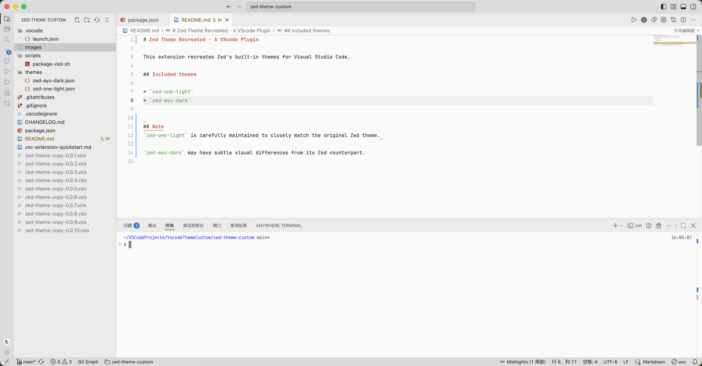

# Zed Theme Recreated - A VScode Plugin

This extension recreates Zed's built-in themes for Visual Studio Code.

## Preview

## Included themes

* `zed-one-light`
* `zed-ayu-dark`

## Note
`zed-one-light` is carefully maintained to closely match the original Zed theme. 

`zed-ayu-dark` may have subtle visual differences from its Zed counterpart.
